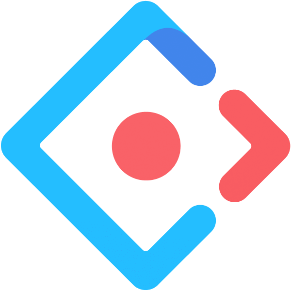
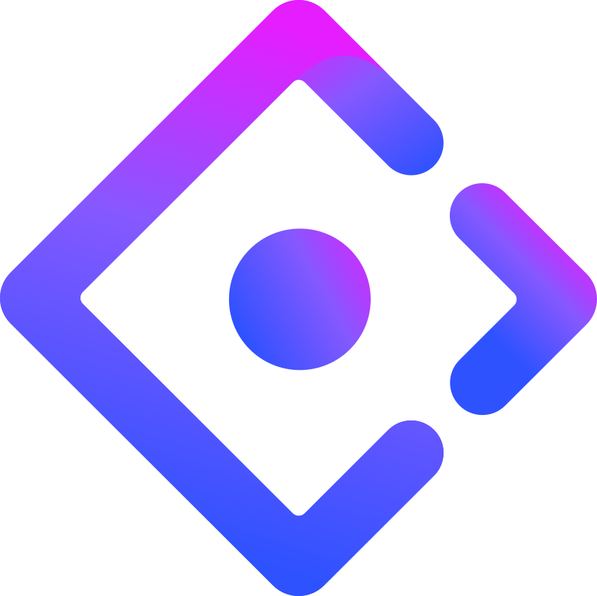
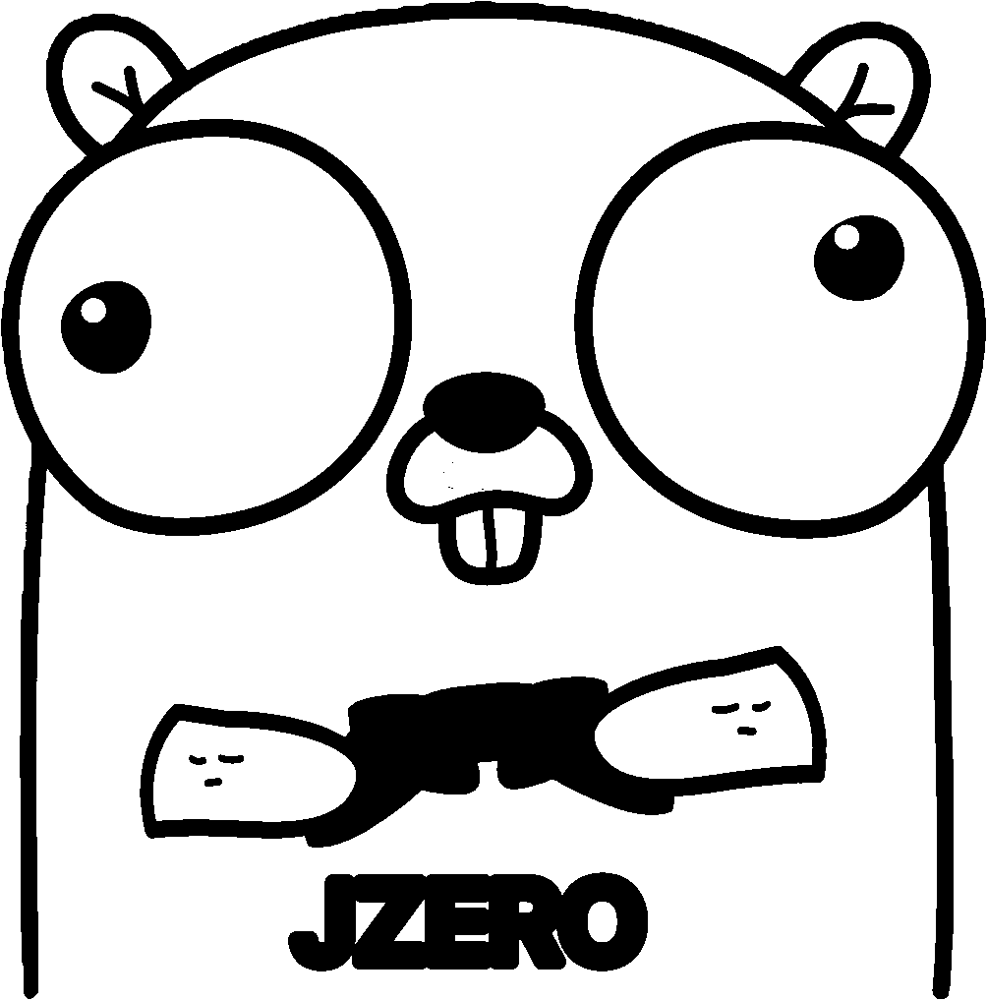
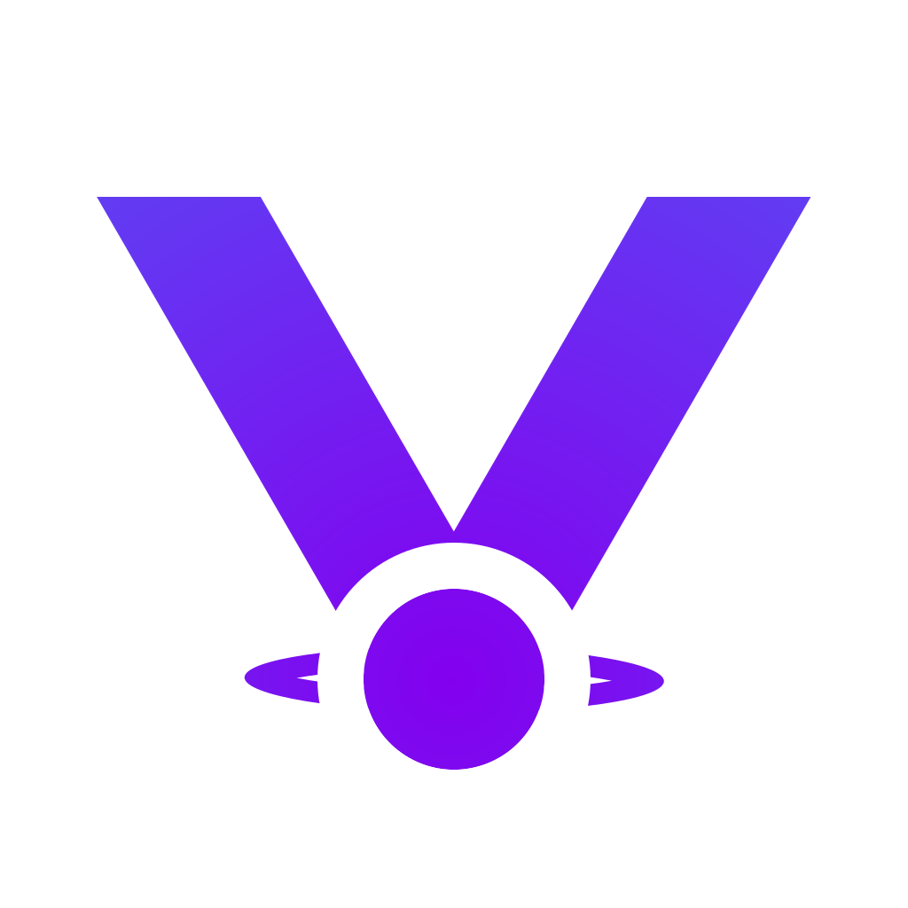
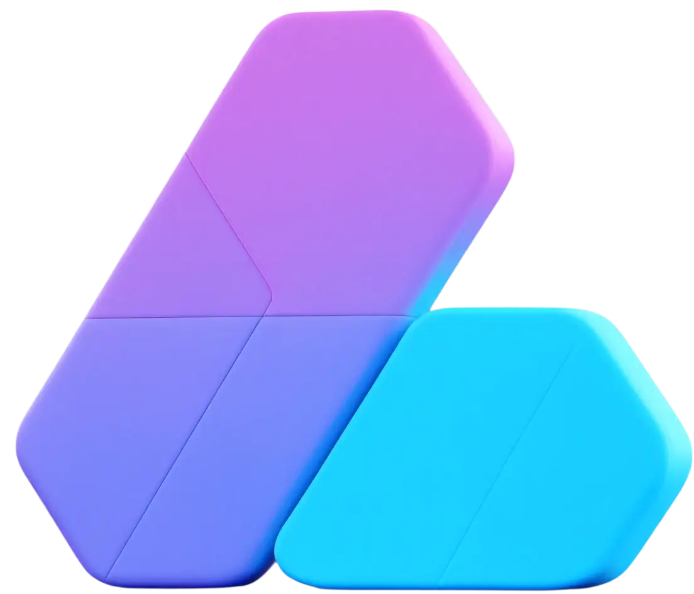

  
[![][image-banner]][homepage-link]

# Openomy

Providing open-source economic solutions with blockchain and AI.  
Code is no longer just behind the product — it *is* the product.

[![][vision-banner]][homepage-link]

---

## ✨ Features

### Contributor charts from a fresh perspective
Traditional contributor charts focus only on commits.  
We believe every form of participation—PRs, issues, discussions, even a single comment—deserves recognition.  
That's why we designed multiple contributor charts / widgets to capture the full spectrum of community activity.

> Try it out:  
> `https://www.openomy.com/<owner>/<repo>`  
> *(Replace `<owner>/<repo>` with your repository path, or simply swap `github` → `openomy` in the URL).*

### Complete repository activity overview
Whether you are a core contributor or just enjoy engaging in issues, all your interactions are visible here—including every little like.  

> A brand-new project-level statistics page is coming soon.

### Unique personal profile *(WIP)*
Every bit of support in the GitHub community should be highlighted.  
We are crafting a dedicated personal page—stay tuned for the upcoming design!

---

## 🚧 Roadmap

- [ ] Unique personal profile page  
  - [ ] In design  
- [ ] General statistics for events such as parties / hackathons
- [ ] Combine AI & blockchain for enhanced data analytics
- [ ] Chart SDK: deeper & richer customization  
- [ ] Data SDK: more flexible analysis capabilities 

---

## 🤝 Supported Projects

Thanks to all community projects already using our charts ❤

  <table border="0" cellpadding="0" cellspacing="16" style="border-collapse: separate; border-spacing: 16px; margin: auto;">
    <tbody>
      <tr>
        <td align="center" valign="top" style="width: 140px; height: 130px;">
          <a href="https://github.com/ant-design/ant-design" title="Ant Design" style="text-decoration: none; color: inherit;">
            
             
            <small>ant-design</small>
          </a>
        </td>
        <td align="center" valign="top" style="width: 140px; height: 130px;">
          <a href="https://github.com/ant-design/x" title="Ant Design X" style="text-decoration: none; color: inherit;">
            
             
            <small>ant-design&nbsp;x</small>
          </a>
        </td>
        <td align="center" valign="top" style="width: 140px; height: 130px;">
          <a href="https://github.com/wzc520pyfm/ant-design-x-vue" title="Ant Design X Vue" style="text-decoration: none; color: inherit;">
            
             
            <small>ant-design-x-vue</small>
          </a>
        </td>
        <td align="center" valign="top" style="width: 140px; height: 130px;">
          <a href="https://github.com/ant-design/ant-design-web3" title="Ant Design Web3" style="text-decoration: none; color: inherit;">
            
             
            <small>ant-design-web3</small>
          </a>
        </td>
        <td align="center" valign="top" style="width: 140px; height: 130px;">
          <a href="https://github.com/antvis/G2" title="AntV G2" style="text-decoration: none; color: inherit;">
            
             
            <small>AntV&nbsp;G2</small>
          </a>
        </td>
      </tr>
      <tr>
        <td align="center" valign="top" style="width: 140px; height: 130px;">
          <a href="https://github.com/antvis/G6" title="AntV G6" style="text-decoration: none; color: inherit;">
            
             
            <small>AntV&nbsp;G6</small>
          </a>
        </td>
        <td align="center" valign="top" style="width: 140px; height: 130px;">
          <a href="https://github.com/element-plus/element-plus" title="Element Plus" style="text-decoration: none; color: inherit;">
            
             
            <small>element-plus</small>
          </a>
        </td>
        <td align="center" valign="top" style="width: 140px; height: 130px;">
          <a href="https://github.com/flipped-aurora/gin-vue-admin" title="Gin Vue Admin" style="text-decoration: none; color: inherit;">
            
             
            <small>gin-vue-admin</small>
          </a>
        </td>
        <td align="center" valign="top" style="width: 140px; height: 130px;">
          <a href="https://github.com/jzero-io/jzero" title="JZero" style="text-decoration: none; color: inherit;">
            
             
            <small>jzero</small>
          </a>
        </td>
        <td align="center" valign="top" style="width: 140px; height: 130px;">
          <a href="https://github.com/lobehub/lobe-chat" title="Lobe Chat" style="text-decoration: none; color: inherit;">
            
             
            <small>lobe-chat</small>
          </a>
        </td>
      </tr>
      <tr>
        <td align="center" valign="top" style="width: 140px; height: 130px;">
          <a href="https://github.com/umijs/mako" title="Mako" style="text-decoration: none; color: inherit;">
            
             
            <small>Mako</small>
          </a>
        </td>
        <td align="center" valign="top" style="width: 140px; height: 130px;">
          <a href="https://github.com/shuimo-design/shuimo-ui" title="Shuimo UI" style="text-decoration: none; color: inherit;">
            
             
            <small>shuimo-ui</small>
          </a>
        </td>
        <td align="center" valign="top" style="width: 140px; height: 130px;">
          <a href="https://github.com/Tencent/tdesign-miniprogram" title="TDesign MiniProgram" style="text-decoration: none; color: inherit;">
            
             
            <small>tdesign-miniprogram</small>
          </a>
        </td>
        <td align="center" valign="top" style="width: 140px; height: 130px;">
          <a href="https://github.com/Tencent/tdesign-react" title="TDesign React" style="text-decoration: none; color: inherit;">
            
             
            <small>tdesign-react</small>
          </a>
        </td>
        <td align="center" valign="top" style="width: 140px; height: 130px;">
          <a href="https://github.com/YunYouJun/valaxy" title="Valaxy" style="text-decoration: none; color: inherit;">
            
             
            <small>valaxy</small>
          </a>
        </td>
      </tr>
      <tr>
        <td align="center" valign="top" style="width: 140px; height: 130px;">
          <a href="https://github.com/element-plus-x/Element-Plus-X" title="Element-Plus-X" style="text-decoration: none; color: inherit;">
            
             
            <small>Element-Plus-X</small>
          </a>
        </td>
        <td align="center" valign="top" style="width: 140px; height: 130px;">
          <a href="https://github.com/vbenjs/vue-vben-admin" title="vue-vben-admin" style="text-decoration: none; color: inherit;">
            
             
            <small>vue-vben-admin</small>
          </a>
        </td>
        <td align="center" valign="top" style="width: 140px; height: 130px;">
          <a href="https://github.com/soybeanjs/soybean-admin" title="soybean-admin" style="text-decoration: none; color: inherit;">
            
             
            <small>soybean-admin</small>
          </a>
        </td>
        <td align="center" valign="top" style="width: 140px; height: 130px;">
          <a href="https://github.com/ayangweb/BongoCat" title="BongoCat" style="text-decoration: none; color: inherit;">
            
             
            <small>BongoCat</small>
          </a>
        </td>
        <td align="center" valign="top" style="width: 140px; height: 130px;">
          <a href="https://github.com/EcoPasteHub/EcoPaste" title="EcoPaste" style="text-decoration: none; color: inherit;">
            
             
            <small>EcoPaste</small>
          </a>
        </td>
        <td align="center" valign="top" style="width: 220px; height: 220px;">
          <a href="https://github.com/HuLaSpark/HuLa" title="EcoPaste" style="text-decoration: none; color: inherit;">
            
             
            <small>HuLa</small>
          </a>
        </td>
      </tr>
    </tbody>
  </table>

---

## 🙌 Contributing

We welcome contributions of **all** kinds.
Check our GitHub Issues and Discussions to get started.

> \[!TIP]  
> We are building a tech-driven forum to foster knowledge exchange, mutual inspiration, and collaborative innovation.  
> Your feedback on product design and user experience is invaluable—join the conversation!

---

## 📮 Contact

- **Email**: <hello@openomy.app> / <openomy.com@gmail.com>
- **X (Twitter)**: [@openomy_hub](https://x.com/openomy_hub)

---

© 2025 [Openomy][profile-link] • Licensed under [Apache 2.0](./LICENSE)

[homepage-link]: https://www.openomy.com/
[image-banner]: https://github.com/user-attachments/assets/5808d60d-74ab-4a7c-a7bd-653eca48b392
[widget-banner]: https://github.com/user-attachments/assets/a757ed9f-a4b3-4b88-a3cd-03979311556f

[vision-banner]: https://github.com/user-attachments/assets/a47fc0a7-de76-41b1-83d9-ec935fba050d
[activites-showcase]: https://github.com/user-attachments/assets/add43daf-bc05-4106-9ecd-27780675e814
[ant-design-openomy]: https://www.openomy.com/github/ant-design/ant-design

[profile-link]: https://github.com/openomy
